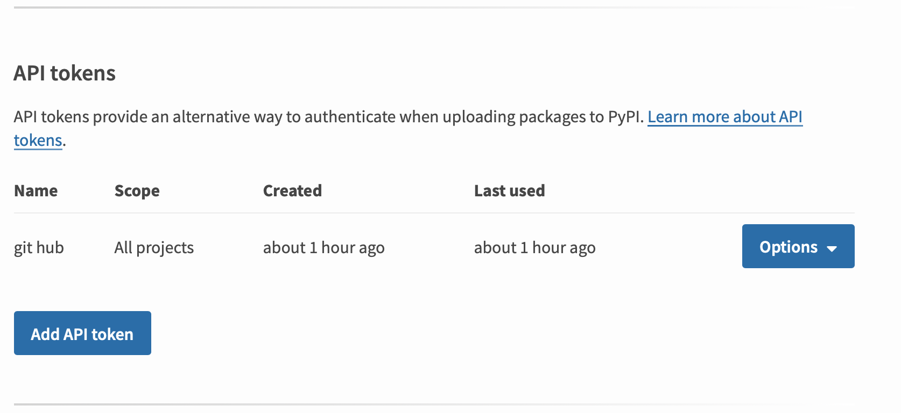
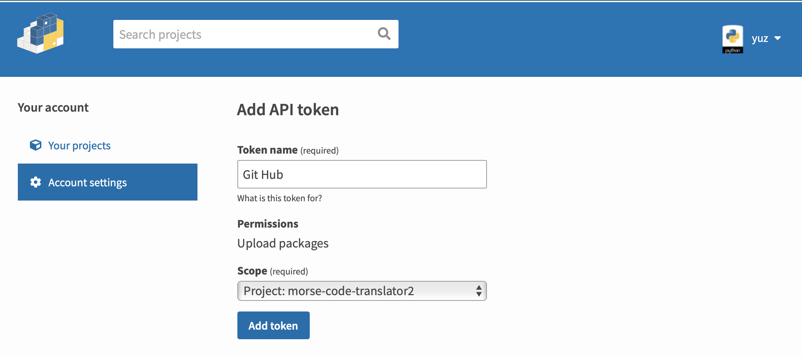
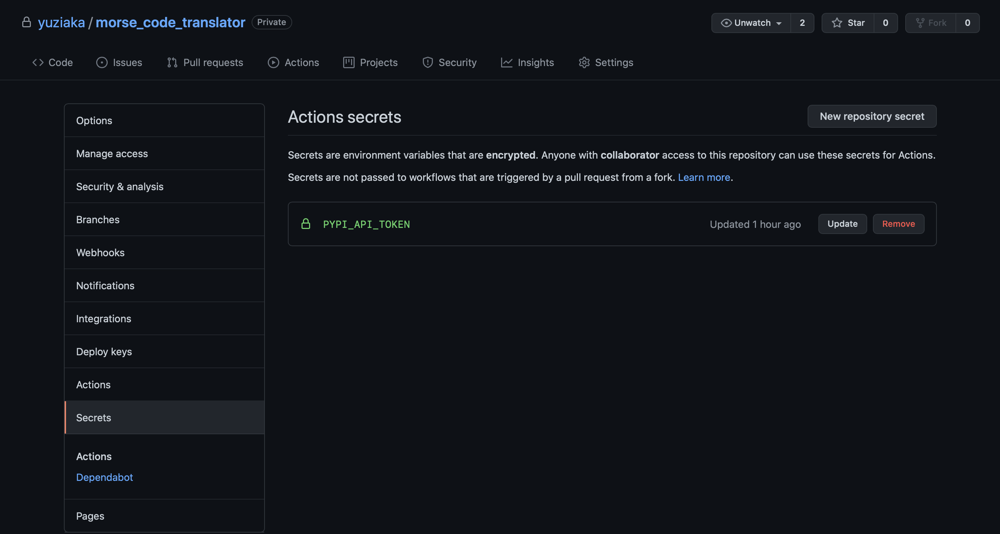
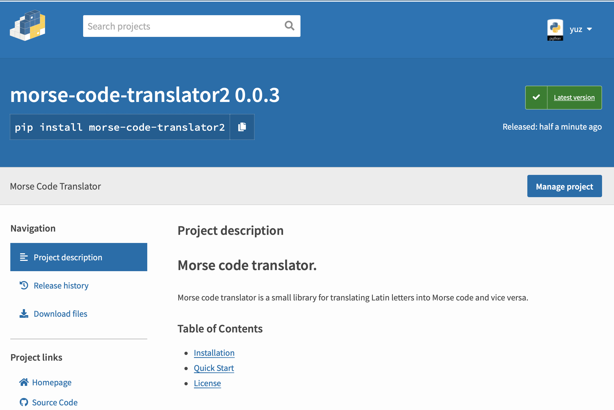

# PyPI - ничего сложного

Меня зовут Юра и последние 8 лет я занимаюсь коммерческой разработкой. 
На данный момент работаю в Харьковском офисе Epam, а в свободное от основной работы время участвую
еще в паре коммерческих проектов.
В этой статье хотел бы рассказать о том, что такое PyPI и для чего он может пригодиться
обычному разработчику. 
И конечно расскажу о том, как создать собственный пакет. 
На выходе у меня должен получится небольшая инструкция по созданию своих собственных PyPI пакетов.

## Intro

Думаю никто не станет спорить, что Python сейчас один из самых популярных языков программирования.
И на это есть очень много причин. 
Однако сегодня нас интересует только одна из этих причин, а именно возможность удобно делится своим
идеями и наработками. 
А для этого всего лишь нужно оформить наш код в виде пакета и опубликовать его на pypi.org.
Есть еще несколько опций, о которых мы поговорим чуть позже.

## Что же такое этот ваш PyPI?

Каждый кто пробовал программировать на Python хотя-бы раз в жизни использовал команду:

```shell
pip install <package_name>
```

Но не каждый задумывался, что же скрывается за этой командой.
Pip это система управления пакетами, которая на данный момент по умолчанию включена в дистрибутив
языка. 
Она используется для установки и управления программными пакетами, написанными на нашем любимом 
Python. 
Откуда же она берет сами пакеты? 
По умолчанию pip ищет пакеты на pypi.org, но у нас есть возможность устанавливать их и из приватных 
PyPI серверов и git репозиториев.
The Python Package Index (PyPI) - это хранилище программного обеспечения для языка Python. 
Он помогает нам найти и установить ПО, разработанное и распространенное сообществом Python. 
На момент написания статьи в нем хранится приблизительно 320К проектов. 
Хотя еще в 2010 их было всего 10К. 

## Для чего это все?

Уже на этом этапе большинство из Вас задался вопросом: “А зачем мне все это?”. 
Ответ на этот вопрос можно разделить на две большие ветки:

- **Мир opensource**

Большинство из нас каждый день пользуется opensource проектами и даже не задумывается об этом.
Те же Pydantic, FastAPI, Django и еще много чего крутого является opensource продуктами.
Множество Python пакетов распространяются по лицензиям, которые позволяют нам пользоваться ими 
бесплатно.
В большинстве случаев, создание проектов начиналось небольшой группой энтузиастов или вообще одного 
человека. 
Если у Вас есть крутая идея ее можно упаковать в пакет и поделится в комьюнити. 
И после прочтения этой статьи у нас будет четкая инструкция для этого. 

- **Мир коммерческой разработки.** 

В современном мире мы все чаще и чаще отказываемся от монолитных решений.
И часто сталкиваемся с необходимостью каким-то образом делится кодовой базой между нашими проектами,
сервисами, Lambda Functions и этот список можно продолжать бесконечно.
Как же быть в этой ситуации? 
Можно упаковывать этот код в пакет и устанавливать из GIT или приватного PyPI server. 
Другой, не менее редкий кейс, это необходимость опубликовать клиентскую библиотеку для работы с 
нашим сервисом. Это позволит сделать его более привлекательным для использования. 
Как пример, `boto3` для работы с сервисами AWS, клиентская библиотека для Stripe и так далее.

Как видите, сценариев применения большое множество, все ограничивается только нашей фантазией.

## Каким же должен быть идеальный пакет?

Давайте подумаем какими качествами должен обладать идеальный пакет как с точки зрения конечного 
пользователя и разработчика:
-	Крутая идея для пакета (с этим у нас правда небольшие проблемы)
-	Актуальная документация
-	Кроссплатформенность
-	Покрытие тестами
-	Статический анализ кода
-	Поддержка актуальных версий языка
-	Использование CI

С моей точки зрения, это минимальный набор качества которым должен обладать любой проект.
Давайте теперь детально поговорим о каждом из этих пунктов.

### Идея для пакета

Я долго думал над идеей для проекта, хотелось что-то не совсем банальное.
Вот на днях смотрели с дочкой передачу про азбуку Морзе. 
И мне показалось, что это будет вполне прикольной идеей для пакета в рамках этой статьи. 

Для упрощения нашего пакета будем поддерживать символы только латиницы. 
И да, этот пакет не несет какого-то смысла для комьюнити, но для нашей цели вполне подойдет.

```python3
from enum import Enum

morse_dictionary = (
    ("a", ".-"),
    ("b", "-..."),
    ("c", "-.-."),
    ("d", "-.."),
    #......
)

lat_to_morse = {lat: morse for lat, morse in morse_dictionary}
morse_to_lat = {morse: lat for lat, morse in morse_dictionary}

class Errors(Enum):
    IGNORE = "ignore"
    REPLACE = "replace"
    STRICT = "strict"

def _translate_char(char: str, dictionary, errors: Errors = Errors.STRICT) -> str:
    char = char.lower()

    try:
        return dictionary[char]
    except KeyError:
        if errors == Errors.STRICT:
            raise ValueError

        if errors == Errors.IGNORE:
            return ""

        if errors == Errors.REPLACE:
            return "?"


def translate_char_to_morse(char: str, errors: Errors = Errors.STRICT):
    return _translate_char(char=char, dictionary=lat_to_morse, errors=errors)


def translate_char_to_lat(char: str, errors: Errors = Errors.STRICT):
    return _translate_char(char=char, dictionary=morse_to_lat, errors=errors)


def translate_to_morse(text: str, errors: Errors = Errors.STRICT):
    return "".join(
        translate_char_to_morse(char=char, errors=errors) if char != " " else "" for char in text
    )


def translate_to_lat(text: str, errors: Errors = Errors.STRICT):
    return " ".join(translate_char_to_lat(char=char, errors=errors) for char in text.split(" "))

```

Теперь у нас есть код которым мы бы хотели поделиться.
Для этого упакуем его в пакет и опубликуем в PyPI.
Но с чего же начать? 

### Документация

Каждый из нас хотя бы раз в жизни сталкивался с необходимостью использования внешнего пакета. 
И если у этого пакета есть хорошая документация с примерами использования, это в разы ускоряет его 
интеграцию.
Что же обязана содержать в себе документация?
- Инструкцию по установке
- Описание методов и классов
- Примеры работы
- Описание исключений

Это все повысит привлекательность нашего пакета и снизит порог вхождения. 

Конечно, можно воспользоваться сервисом [readthedocs.org](https://readthedocs.org) и генерацией 
документации с помощью [Sphinx](https://www.sphinx-doc.org/en/master/), но для нашего проекта мы 
обойдемся только `README.md`, его будет более чем достаточно.

```markdown 

include ./README.md

```

### Контроль зависимостей

Для этого можно использовать как `requirements.txt` так и какие-то более продвинутые инструменты.
Я буду использовать [Poetry](https://python-poetry.org/), так как этот инструмент более привычный 
для меня. 
Для того чтобы разобрать, что это за инструмент, можно пройти по пути из
[официальной документации](https://python-poetry.org/docs/). 

### Статический анализ кода

Для статического анализа кода существует большое количество библиотек и инструментов.
И они в большей степени дополняют друг друга. 
Практически все анализаторы можно тонко настроить под свои нужды.
Для этого обычно используется один из файлов: `tox.ini`, `setup.cfg` или `pyproject.toml`. 
Мне более привычно использовать второй вариант, с ним и будут примеры.
И да, настроив один раз этот файл, его можно использовать и на других проектах.

#### iSort

Это утилита/библиотека для сортировки импортируемых файлов в алфавитном порядке с автоматическим 
разделением на разделы по типу. 
Предоставляет утилиту командной строки и так же легко встраивается в большинство популярных 
редакторов.

```buildoutcfg
[isort]
# See https://github.com/timothycrosley/isort#multi-line-output-modes
multi_line_output = 3
include_trailing_comma = true
sections = FUTURE,STDLIB,THIRDPARTY,FIRSTPARTY,LOCALFOLDER
default_section = FIRSTPARTY
# Should be: 100 - 1
line_length = 99
wrap_length = 99
```

Для запуска можно использовать:

```shell
poetry run isort .
```

#### flake8

Инструмент, позволяющий просканировать код проекта и обнаружить в нем стилистические ошибки и 
нарушения различных конвенций кода на Python. 
Flake8 умеет работать не только с PEP 8, но и с другими правилами, к тому же он поддерживает 
сторонние плагины.

```buildoutcfg
[flake8]
max-line-length = 100

# flake8-quotes plugin settings
inline-quotes = "

#flake8-import-order plugin settings
application-import-names = apps
import-order-style = google

# flake8-docstrings plugin settings
docstring-convention = google

max-complexity = 12
```

Для запуска анализа выполняем:

```shell
poetry run falke8 .
```

#### black

[Black](https://github.com/psf/black) - бескомпромиссное средство форматирования кода Python. 
Используя его, мы соглашаемся передать контроль над мелочами ручного форматирования. 
В свою очередь, Black дает нам скорость, детерминизм и свободу от ворчаний по поводу форматирования. 
А мы сэкономим время и умственную энергию для более важных дел. 
При этом он легко встраивается во все современные редакторы.

Для запуска можно использовать:

```shell
poetry run black .
```

Для нашего пакета этого списка будет более чем достаточно.
При желании, его можно расширить. 
К примеру, для контроля типизации можно использовать`mypy`, а для контроля сложности можно 
использовать `xenon`.  

## Тестирование

Автоматизация тестирования очень важна, особенно если мы хотим поддерживать разные версии языка и 
разные платформы. 
Для тестирования выбрал свой любимый `pytest`. 
Про него могу рассказывать бесконечно, может как-то напишу и о нем.
Но сейчас давайте вернемся к нашему пакету. 

### Структура проекта

Тесты будем хранить отдельно от нашего кода, в случае дистрибуции это лучшее решение.

```
root/
    morse_code_translator/
        __init__.py
        dictionary.py
        translator.py
    tests/
        test_translator.py
    conftest.py
```

### Настройка

В настройке `pytest` есть очень много возможностей, но нам будет достаточно минимального количества
настроек.

```buildoutcfg
[tool:pytest]
python_files = tests.py test_*.py *_tests.py

# Directories that are not visited by pytest collector:
norecursedirs = *.egg .eggs dist build docs .tox .git __pycache__

# You will need to measure your tests speed with `-n auto` and without it,
# so you can see whether it gives you any performance gain, or just gives
# you an overhead. See `docs/template/development-process.rst`.
addopts = --cache-clear
          --strict-markers
          --tb=short
          --doctest-modules
          --cov=morse_code_translator
          --cov-report=term-missing:skip-covered
          --cov-report=xml
          --cov-fail-under=100
```

И да, конечно же мы будем измерять покрытие тестами.

```buildoutcfg
[coverage:run]
branch = True
omit = *tests*
```

### Пишем тесты
```python3
import random

import pytest

from morse_code_translator.enums import Errors
from morse_code_translator.dictionary import morse_dictionary, lat_to_morse, morse_to_lat
from morse_code_translator.translator import translate_to_morse, translate_to_lat


def test_dictionary_len():
    assert len(morse_dictionary) == len(lat_to_morse) == len(morse_to_lat)


def test_dictionary_map():
    random_element = random.choice(morse_dictionary)
    assert lat_to_morse[random_element[0]] == random_element[1]
    assert morse_to_lat[random_element[1]] == random_element[0]


@pytest.mark.parametrize(
    "input, output, errors",
    (
        (
            "Morse Code Translator!!",
            "-- --- .-. ... .  -.-. --- -.. .  - .-. .- -. ... .-.. .- - --- .-.",
            Errors.IGNORE,
        ),
        (
            "MORSE CODE TRANSLATOR!!",
            "-- --- .-. ... .  -.-. --- -.. .  - .-. .- -. ... .-.. .- - --- .-.",
            Errors.IGNORE,
        ),
        (
            "Morse Code Translator!!",
            "-- --- .-. ... .  -.-. --- -.. .  - .-. .- -. ... .-.. .- - --- .-. ? ?",
            Errors.REPLACE,
        ),
        (
            "MORSE CODE TRANSLATOR!!",
            "-- --- .-. ... .  -.-. --- -.. .  - .-. .- -. ... .-.. .- - --- .-. ? ?",
            Errors.REPLACE,
        ),
        (
            "Morse Code Translator",
            "-- --- .-. ... .  -.-. --- -.. .  - .-. .- -. ... .-.. .- - --- .-.",
            Errors.STRICT,
        ),
        (
            "MORSE CODE TRANSLATOR",
            "-- --- .-. ... .  -.-. --- -.. .  - .-. .- -. ... .-.. .- - --- .-.",
            Errors.STRICT,
        ),
    ),
)
def test_success_translate_to_morse(input, output, errors):
    assert translate_to_morse(input, errors=errors) == output


def test_fail_translate_to_morse():
    with pytest.raises(ValueError):
        translate_to_morse("Morse Code Translator!!", errors=Errors.STRICT)


@pytest.mark.parametrize(
    "input, output, errors",
    (
        (
            "-- --- .-. ... .  -.-. --- -.. .  - .-. .- -. ... .-.. .- - --- .-. ..... -----",
            "morse code translator",
            Errors.IGNORE,
        ),
        (
            "-- --- .-. ... .  -.-. --- -.. .  - .-. .- -. ... .-.. .- - --- .-. ..... -----",
            "morse code translator??",
            Errors.REPLACE,
        ),
        (
            "-- --- .-. ... .  -.-. --- -.. .  - .-. .- -. ... .-.. .- - --- .-.",
            "morse code translator",
            Errors.STRICT,
        ),
    ),
)
def test_success_translate_to_lat(input, output, errors):
    assert translate_to_lat(input, errors=errors) == output


def test_fail_translate_to_lat():
    with pytest.raises(ValueError):
        translate_to_lat(
            "-- --- .-. ... .  -.-. --- -.. .  - .-. .- -. ... .-.. .- - --- .-. ..... -----",
            errors=Errors.STRICT,
        )
```

А для запуска будем использовать:

```shell
poetry run pytest
```


## Лицензирование

Вообще видов лицензий очень много.
Так как наш будущий пакет будет выпущен как opensource, то идеальной для нас лицензией будет MIT.
Хоть MIT и не единственная лицензия для opensource проектов, но самый распространенный выбор для
подобных библиотек.
С выбором нам может помочь к примеру этот [ресурс](https://choosealicense.com/).

Любой наш выбор будет явно лучше, чем если бы мы не сделали выбор вообще.
Выпуск пакета без лицензии по сути равен не выпуску пакета. 
Так же это убережет нас от воровства нашего кода.
Так как большинство компаний не рискнет использовать пакет без лицензии по причине того, что это 
несет за собой большие риски в виде юридических последствий.
Лицензия должна хранится в файле `LICENSE` в корне проекта.

```
MIT License

Copyright (c) 2021 Yura Bondarenko

.....

```


## Сборка и публикация пакета. 

Вот мы и подошли к самому интересному, а именно к сборке и публикации.

### Подготовка к сборке

Для того чтобы упаковать наш код в пакет, мы будем использовать `setup.py`.
Этот файл содержит информацию о нашем будущем пакете, которая необходима для PyPI. 
Например: название, описание, версия пакета и еще много всего.

Ниже `setup.py` который описывает наш будущий пакет.

```python3
import os
from setuptools import find_packages, setup

ROOT = os.path.dirname(__file__)


with open("README.md", encoding="utf-8") as f:
    README = f.read()


setup(
    name="morse-code-translator2",
    version="0.0.1",
    description="Morse Code Translator",
    long_description=README,
    long_description_content_type="text/markdown",
    author="Yurii Bondarenko",
    author_email="ybondarenko.job@gmail.com",
    url="https://github.com/",
    packages=find_packages(
        exclude=[
            "*tests*",
            "poetry.lock",
            "pyproject.toml",
            "TOPIC.md",
            "conftest.py",
            ".venv",
        ]
    ),
    package_dir={"morse_code_translator": "morse_code_translator"},
    python_requires=">=3.6.*",
    license="MIT",
    install_requires=[],
    classifiers=[
        "Programming Language :: Python",
        "Programming Language :: Python :: 3",
        "Programming Language :: Python :: 3.6",
        "Programming Language :: Python :: 3.7",
        "Programming Language :: Python :: 3.8",
        "Programming Language :: Python :: 3.9",
    ],
    project_urls={
        "Documentation": "",
        "Source Code": "https://github.com/",
    },
    tests_require=[],
)
```

Давайте пройдемся по файлу и посмотрим что здесь происходит.
Сначала мы импортируем из модуля `setuptools` несколько функций.
Читаем `README.md`.
Вызываем функцию `setup` с большим количеством аргументов.
Хотя большинство аргументов понятны и не требуют пояснения, давайте пройдемся по основным:

- `author` - имя автора

- `author_email` - контактный email автора

- `license` - название лицензии в нашем случае это `MIT`

- `description` - короткое, однострочное описание пакета

- `version` - текущая версия пакета

- `long_description` - если переводить буквально то это длинное описание пакета, самым 
распространенным и удачным решением для этого есть README.md

- `url` - URL который ведет на главную страницу пакета, или, если ее нет, то на репозиторий

- `packages` - в этом поле мы используем `setuptools`. TODO.

- `python_requires` - описывает какие версии языка поддерживает Ваш пакет

- `install_requires` - в этом пункте указываем все внешние зависимости нашего пакета как пример
`["requests", "pytz"]`

- `classifiers` - так как пакетов много, то их необходимо классифицировать. 
Для этих целей и служит это поле. Полный список доступных значений можно посмотреть по
[ссылке](https://pypi.python.org/pypi?%3Aaction=list_classifiers)

Ну что ж теперь мы готовы к самому главному, к ~~рождению~~ сборке нашего пакета.

### Сборка пакета

Не буду вдаваться в подробности о различных форматах распространения пакетов, мы будем
использовать стандартный подход.
Для начала убедимся, что у нас установлена последняя версия `setuptools` и `wheel`:

```shell
pip install --upgrade setuptools wheel
```

Теперь собираем наш пакет.
Для этого выполняем:

```shell
python setup.py sdist bdist_wheel
```

В результате выполнения этой команды, будет создано три каталога `build`, `dist` и 
`morse_code_translator.egg-info`.
Все эти каталоги добавляем в `.gitignore`.
Но самые интересные для нас это два файла из `dist`, а именно:

- `morse-code-translator2-0.0.1.tar.gz` - архив с нашим кодом

- `morse_code_translator2-0.0.1-py3-none-any.whl` - wheel файл

Именно эти два файла мы и будем загружать в PyPI. 
Теперь мы можем перейти к загрузке нашего пакета. 

### Публикация

Мы практически у цели, нас осталось только загрузить наш пакет на сервер PyPI.
Для этого [регистрируемся на pypi.org](https://pypi.org/account/register/).

Но было бы не плохо протестировать загрузку пакета перед публикацией на глобальном сервере.
Для этого есть [тестовый сервер PyPI](https://test.pypi.org/account/register/).

Имя пользователя и пароль можно сохранить в `.pypirc` в корне вашего домашнего каталога.

```shell
[distutils]
index-servers =
  pypi
  testpypi
[pypi]
username: username
password: myPassword
[testpypi]
repository: https://test.pypi.org/legacy/
username: username
password: myPassword
```

Секция `testpypi` не обязательна.

Для загрузки будем использовать `twine`, для этого добавим его в зависимости:

```shell
poetry add twine --dev
```

Для загрузки на тестовый сервер выполняем: 

```shell
twine upload --repository testpypi dist/*
```

А для загрузки на глобальный сервер:

```shell
twine upload --repository dist/*
```

Ну вот мы и у цели. Наш пакет 
[опубликован](https://test.pypi.org/project/morse-code-translator2/0.0.1/)  (TODO: заменить ссылку)


## Автоматизация

Все это конечно очень интересно, но хотелось бы максимально автоматизировать процесс публикации.
Так как наш проект хранится в Github-е то для автоматизации будем использовать GitHub CI.

### GitHub CI

GitHub, как и большинство современных git репозиториев, поддерживает процесс непрерывной интеграции.
В GitHub это реализовано с помощью [GitHub Actions](https://docs.github.com/en/actions).
Нам надо будет добавить Action, который будет тестировать, собирать и заливать нашу новую версию
пакете в PyPI.


Actions в репозиторий можно добавлять несколькими способами.
Для нас более удобным будет создать его вручную, для этого создаем две директории `.github` и 
`workflows` которая вложена в первую, она и будет хранилищем наших Actions.
В итоге у нас получается такая структура: 

```
root/
    .github/
        workflows/
            publish_package.yml
    morse_code_translator/
        ....
    tests/
        ....
    ....
```

Перед тем как мы начнем писать наш Action, получим токен для публикации в PyPI.

Для этого идем в [настройки PyPI аккаунта](https://pypi.org/manage/account/).
И пролистав эту страницу, мы увидим секцию "API tokens".



Нажимаем на кнопку "Add API token", вводим название нашего токена, у меня это `GitHub`, 
выбираем наш пакет и создаем токен.



Дальше идем в настройки git репозитория и создаем секрет с именем `PYPI_API_TOKEN`, значением 
будет наш токен. 



Теперь у нас есть все для того, что бы создать наш GitHub Action.
Создаем `.yml` файл в котором описываем наши задачи.

`.github/workflows/publish_package.yml`:

```yaml
name: Publish package

on:
  push:
    tags:
      - 'v*'
jobs:
  static_analysis:
    runs-on: ${{ matrix.os }}
    strategy:
      matrix:
        os: [ubuntu-latest, macos-latest, windows-latest]
        python-version: [ 3.6, 3.7, 3.8, 3.9 ]
    steps:
      - uses: actions/checkout@v2
      - name: Set up Python ${{ matrix.python-version }}
        uses: actions/setup-python@v2
        with:
          python-version: ${{ matrix.python-version }}
      - name: Install dependencies
        run: |
          python -m pip install --upgrade pip
          pip install poetry
          poetry install
      - name: Lint with flake8
        run: |
          poetry run flake8 --count --show-source --statistics --exit-zero
      - name: Lint with isort
        run: |
          poetry run isort .
      - name: Test with pytest
        run: |
           poetry run pytest
  deploy:
    runs-on: ubuntu-latest
    needs: static_analysis
    steps:
      - uses: actions/checkout@v2
      - name: Set up Python
        uses: actions/setup-python@v2
        with:
          python-version: '3.6'
      - name: Install dependencies
        run: |
            python -m pip install --upgrade pip
            pip install poetry
            poetry install --no-interaction --no-ansi --no-dev
      - name: Upgrade setuptools
        run: python -m pip install --upgrade setuptools wheel
      - name: Build package
        run: python setup.py sdist bdist_wheel
      - name: Publish package
        uses: pypa/gh-action-pypi-publish@27b31702a0e7fc50959f5ad993c78deac1bdfc29
        with:
          user: __token__
          password: ${{ secrets.PYPI_API_TOKEN }}
```

Давайте разберемся что же здесь происходит.
Первая строчка указывает название `name: Publish package`.

Следующая секция описывает условия запуска.
В нашем случае он будет реагировать на создание тегов, которые начинаются с `v`:
```yaml
on:
  push:
    tags:
      - 'v*'
```

Последняя секция описывает задачи, в нашем случае их две.

Первая задача это `static_analysis`, в ней мы запускаем flake8, isort и pytest. 
Так как мы заявляем поддержку Python 3.6+ в операционных системах Linux, MacOS и Windows, то нам 
нужно и тестировать наш пакет в этих средах.
Для этого используется такое свойство как `matrix`:

```yaml
strategy:
  matrix:
    os: [ubuntu-latest, macos-latest, windows-latest]
    python-version: [ 3.6, 3.7, 3.8, 3.9 ]
```

В нашей матрице используется две переменные.
Первая — это `os`, в ней мы записываем список поддерживаемых операционных систем.
А во второй, `python-version`, перечень поддерживаемых нами версий Python.
И, как итог, CI запустит эту задачу 12 раз.
Но почему так?
Все очень просто, он перебирает все возможные комбинации наших переменных, в нашем случае их 12.
Таким образом, наши тесты будут запущены во всех поддерживаемых нами окружениях.

Вторая задача — это `deploy`. 
У нее есть две особенности.
Первая, это блок:

```yaml
needs: static_analysis
```

Этой строчкой мы говорим, что, перед тем как запустить эту задачу, должна удачно отработать задача
`static_analysis`.

Вторая — это использование секрета, который мы создали ранее:

```yaml
- name: Publish package
  uses: pypa/gh-action-pypi-publish@27b31702a0e7fc50959f5ad993c78deac1bdfc29
  with:
    user: __token__
    password: ${{ secrets.PYPI_API_TOKEN }}
```


Как результат, для того чтобы опубликовать новую версию пакета, достаточно выполнить две команды.

Первая создаст тег, при этом даст ему название, используя версию нашего пакета, которая указана в 
`setup.py`:

```shell
git tag -a v$(python setup.py --version) -m 'description of version'
```

Вторая втолкнет новый тег в репозиторий, что и запустит наш Action:

```shell
git push --tags
```

Вот так это выглядит в github:


И вот так выглядит наш пакет:



## Заключение

Изначальной целью статьи было написать инструкцию, следуя которой можно опубликовать свой пакет.
Но походу стати я задел много смежных с этой темой аспектов, которые будет полезны не только при 
публикации пакетов.
Надеюсь эта статья будет полезна.

Спасибо всем кто дочитал.